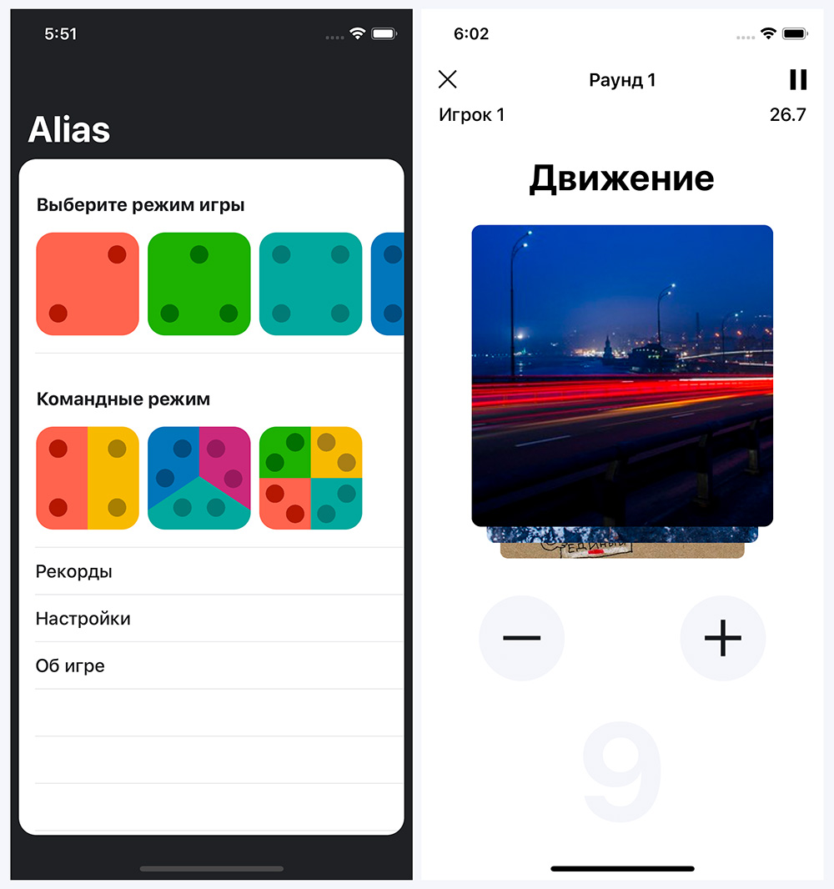

# Alias
Alias – игра для iPhone, в которой участникам предлагается поочередно или объяснять появляющиеся слова, или отгадывать их.

<p align="left">

</p>

### Возможности
- Количество игроков от двух до девяти
- Для четырёх, шести и восьми игроков доступны командные режимы

В приложение доступно около 5000 слов, которые разделены на пять списков:
- Русские существиетльные
- Русские глаголы
- Русские прилагательные
- English nouns
- English verbs

### Статистика проекта

| Объект                               | Количество |
|--------------------------------------|------------|
| Строк                                | 5534       |
| Модуль уровня Presentation           | 9          |
| Модуль уровня Service                | 4          |
| Модуль уровня Core                   | 2          |
| API                                  | 2          |
| Class                                | 61         |
| Protocol                             | 63         |
| Struct                               | 14         |
| *\.swift                              | 71         |

Информация обновлена 7 декабря 2019 года.

### Защищённый переводчик

Для безопасного хранения токена для доступа к ресурсу Яндекс.Переводчик, сервис `SafeTranslater` не хранит токен в явном виде, а формирует его во время исполнения. При этом для защиты токена от статического анализа, анализа исходных кодов, используется **обфускация**, от динамического – **обнаружение отладчика и противодействие** получения им истинного значения токена. Также, для сервиса применена **защита от встраивания** модуля в другие проекты. Использование такого сервиса в проекте в виде исходного кода значительно снижает безопасность ключа. Такой способ хранения был предпочтен бинарной библиотеке в связи с принципом обеспечения информационной безопасности – разумной достаточности. Для выбранного способа хранения сервиса автору известны простые способы восстановления истинного значения токена.

На текущий момент в проекте не используются возможности защищённого переводчика. Код формировался в то время, когда брались английские слова из интернета и было необходимо отобразить в приложении его русский эквивалент. Сейчас списки слов хранятся в файлах формата CSV и при первой загрузке загружаются в память, после чего сохраняются в Core Data, из которой позже они и будут взяты.


### Уменьшение размера архива приложения

На 7 декабря 2019 г. архив приложения занимает 1,2 MB

В коммитах от 22 ноября 2019 г.:
```
bca7e7519bf35ae0a453000b17f85fcf924af1c3
a5eb124e21e295077a18aa3cbb2c49aff80f336d
41e78330ff8dd518c36409cfa607bb3d7cd2ad50
```
 к спроектированным модулям проекта были применены следующие оптимизации:


| Оптимизация                                                                                                                                                                                                                         | Размер | Время |
|-------------------------------------------------------------------------------------------------------------------------------------------------------------------------------------------------------------------------------------|---------------|-------|
| Deployment Target – 12\.1, Debug                                                                                                                                                                                                    | 44,6 MB       | 14:49 |
| Deployment Target – 12\.1, Release                                                                                                                                                                                                  | 42,6 MB       | 14:49 |
| Deployment Target – 12\.2, Debug                                                                                                                                                                                                    | 2,5 MB        | 14:50 |
| Deployment Target – 12\.2, Release                                                                                                                                                                                                  | 2,1 MB        | 14:48 |
| Deployment Target – Default, Debug                                                                                                                                                                                                  | 2,5 MB        | 14:45 |
| Deployment Target – Default, Release                                                                                                                                                                                                | 2,1 MB        | 14:47 |
| Deployment Target – 12\.2, Debug, \- libswiftRemoteMirror\.dylib                                                                                                                                                                    | 787 KB        | 14:53 |
| Deployment Target – 12\.2, Release, \- libswiftRemoteMirror\.dylib                                                                                                                                                                  | 405 KB        | 14:53 |
| Deployment Target – 12\.2, Release, \- libswiftRemoteMirror\.dylib \+ Osize                                                                                                                                                         | 425 KB        | 15:22 |
| Deployment Target – 12\.2, Release, \- libswiftRemoteMirror\.dylib \- Disable Safety Checks                                                                                                                                         | 361 KB        | 15:29 |
| Deployment Target – 12\.2, Release, \- libswiftRemoteMirror\.dylib \- Disable Safety Checks \- nibs \+ manual layout \- metadata                                                                                                    | 353 KB        | 21:37 |
| Deployment Target – 12\.2, Release, \- libswiftRemoteMirror\.dylib \- Disable Safety Checks \- nibs \+ manual layout \- metadata \+ objc direct call presenters methods                                                             | 347 KB        | 22:28 |
| Deployment Target – 12\.2, Release, \- libswiftRemoteMirror\.dylib \- Disable Safety Checks \- nibs \+ manual layout \- metadata \+ objc direct call presenters methods \- empty assets \- empty icon                               | 347 KB        | 22:34 |
| Deployment Target – 12\.2, Release, \- libswiftRemoteMirror\.dylib \- Disable Safety Checks \- nibs \+ manual layout \- metadata \+ objc direct call presenters methods \- empty assets \- empty icon \+ if def debug \+ debugPrint | 345 KB        | 22:53 |

## Технические особенности
- архитектура приложения – SOA (Service-Oriented Architecture)
- архитектура слоя представления – VIPER

## Список литературы
* [iOS Школа - SberGraduate](https://sbergraduate.ru/ios-school/)
* [API Переводчика - Технологии Яндекса](https://yandex.ru/dev/translate/)
* [Архитектурные паттерны в iOS / Блог компании Badoo / Хабр](https://habr.com/ru/company/badoo/blog/281162/)

### Авторы
* [Зорькин Андрей](https://github.com/zooorkin)

### Авторские права
Copyright © 2019 Андрей Зорькин. All rights reserved.
